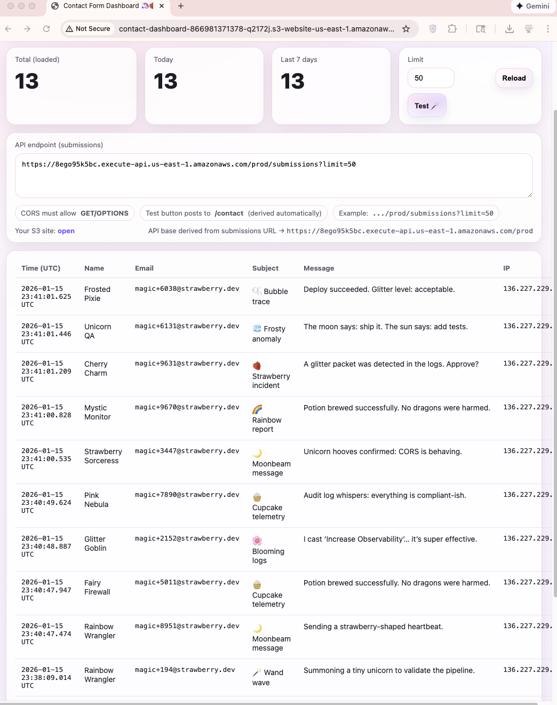

# 🦄🍓 Serverless Contact Form Dashboard on AWS

A fully serverless contact form system with a real-time dashboard, built using AWS native services.

This project demonstrates how to design, deploy, and operate a lightweight production-ready inbox without traditional servers.

http://contact-dashboard-866981371378-q2172j.s3-website-us-east-1.amazonaws.com/

## ✨ Features

- Serverless contact form backend (AWS Lambda)
- Email delivery via Amazon SES
- Persistent storage in DynamoDB
- REST API powered by API Gateway
- Static dashboard hosted on S3
- Built-in test button for synthetic traffic
- CORS-safe, observable, and cost-efficient

## 🏗 Architecture

S3 (Dashboard UI)
↓
API Gateway
↓
Lambda (Writer / Reader)
↓
DynamoDB + SES

## 📸 Dashboard Preview

## 🛠 Technologies Used

- AWS Lambda (Python 3.12)
- Amazon API Gateway
- Amazon DynamoDB
- Amazon SES
- Amazon S3 (static website hosting)
- Vanilla HTML / CSS / JavaScript

## 🚀 Why This Project

I wanted to build a real-world, production-style serverless system without relying on frameworks or the AWS console UI.

The focus was on:
- clear architecture
- observability
- security boundaries
- and developer experience

## 📬 Use Cases

- Website contact forms
- Internal QA/testing endpoints
- Lightweight inbox for small projects
- Demonstration of serverless architecture patterns

## ⚠️ Notes

Infrastructure is created manually via AWS CLI.
Secrets and sensitive values are intentionally excluded.

aws-contact-form-dashboard/
│
├── dashboard/
│   ├── index.html
│   ├── styles.css
│   └── app.js
│
├── lambda/
│   ├── writer/
│   │   └── lambda_function.py
│   └── reader/
│       └── lambda_reader.py
│
├── infra/
│   ├── iam/
│   │   └── policies.json
│   └── notes.md
│
├── screenshots/
│   └── dashboard.png
│
├── README.md
└── .gitignore
